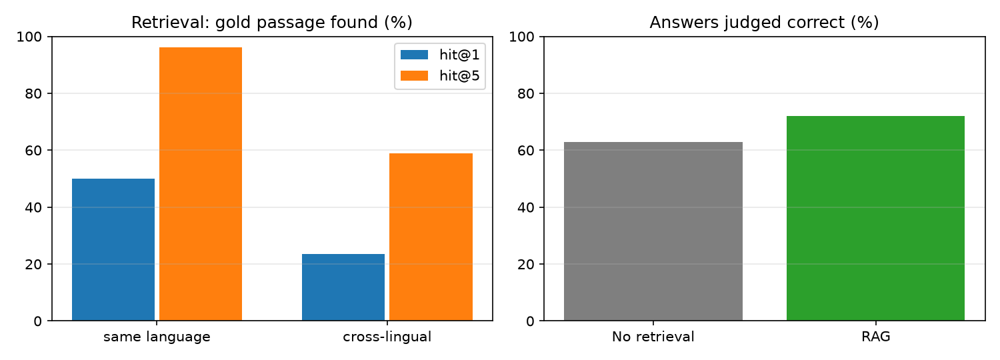

# Korean-English Semiconductor Q&A Assistant (RAG)

A retrieval-augmented assistant that answers semiconductor questions **in Korean or English, with numbered source citations**, using Korean and English Wikipedia as its knowledge base. Everything runs **locally with Ollama**: no API key, and no data leaves the laptop. The project includes a proper evaluation: a human-reviewed test set, retrieval metrics, cross-lingual analysis, and a RAG vs no-RAG comparison.

> 한국어·영어 위키백과의 반도체 문서를 지식 베이스로, 질문에 출처 번호와 함께 답하는 RAG(검색 증강 생성) 시스템입니다. Ollama로 로컬에서 실행되어 API 키나 외부 전송이 필요 없습니다. 다국어 임베딩(bge-m3)으로 한국어 질문에 영어 문서를, 영어 질문에 한국어 문서를 찾습니다. 직접 검수한 43문항에서 RAG 적용 후 정답률이 63%→72%로, 언어 간(cross-lingual) 질문에서는 47%→76%로 향상되었습니다.

## Why this matters

Large companies are building internal assistants over manuals, process documents, and reports. Two problems decide whether engineers trust them: **hallucination** (confident wrong answers) and **mixed languages** (Korean questions, English documents). This project tackles both: answers must cite their sources, the model must say when the sources don't contain an answer, and one multilingual embedding model retrieves across Korean and English.

## How it works

1. `build_corpus.py` downloads about 35 Korean and English Wikipedia articles (DRAM, NAND, HBM, lithography, etching, CVD, yield, packaging, and more) and splits them into ~600-character chunks.
2. `rag.py index` embeds every chunk with **bge-m3** (multilingual) and stores normalized vectors.
3. `rag.py ask` embeds the question, finds the top-5 chunks by cosine similarity, and asks **Qwen2.5-3B** to answer using only those numbered sources, citing them as [1], [2].
4. `make_eval.py` drafts one question per sampled chunk (half written in the other language) for **you to review by hand**.
5. `evaluate.py` measures retrieval and answer quality. A different model family (**Llama 3.1 8B**) judges the answers, so no model grades its own work.

## Results

43 human-reviewed questions (26 same-language, 17 cross-lingual) over 33 Korean and English Wikipedia articles (1,398 chunks). Answer model Qwen2.5-3B, embeddings bge-m3, judge Llama 3.1 8B (a different model family). All local on a MacBook Air.

**Retrieval** (is the source passage of the question found?)

| | hit@1 | hit@5 | MRR |
| --- | --- | --- | --- |
| Same language (26) | 50% | **96%** | 0.68 |
| Cross-lingual (17) | 24% | 59% | 0.37 |
| All (43) | 40% | 81% | 0.56 |

**Answers** (judged correct)

| | No retrieval | RAG |
| --- | --- | --- |
| Same-language questions | 73% (19/26) | 69% (18/26) |
| Cross-lingual questions | 47% (8/17) | **76% (13/17)** |
| All questions | 63% | **72%** |
| Answers citing the gold source (when it was retrieved) | n/a | 69% |



**What the results show**

1. **Retrieval works well within a language and drops across languages.** The right passage is in the top 5 for 96% of same-language questions but only 59% of cross-lingual ones. One multilingual embedding model helps, but Korean↔English matching is clearly harder.
2. **RAG helps most where the model's own knowledge is weakest.** On cross-lingual questions (mostly detailed English-source facts asked in Korean, or Korean-source facts asked in English) RAG raised correctness from 47% to 76%. On same-language questions about general topics, the 3B model already knew most answers, so RAG added nothing.
3. **The main failure is over-refusal, not hallucination.** In 9 of 43 answers the model said "제공된 자료에서 답을 찾을 수 없습니다" even when the right passage was retrieved, sometimes at rank 1. The strict "only use the sources" prompt makes a small model too cautious. Of the 6 questions where RAG did worse than no retrieval, most were refusals like this.
4. **Prompt bug found:** the system prompt's Korean example sentence made the model answer some English questions in Korean. The fix is to give the refusal sentence in both languages.
5. **Evaluation itself needed checking.** A first run with a 2B judge (Gemma2) labeled almost everything "partial" and even graded an off-topic answer "correct", making RAG and no-RAG look the same. Switching to a stronger judge from a different model family gave consistent labels. And the 3B model's auto-generated Korean questions were often garbled ("디바이스 유리" for device yield), so 17 of 60 were removed and 10 fixed by hand.

**Next improvements:** a hybrid retriever (BM25 keyword search + embeddings) for cross-lingual technical terms, a reranker on the top 10, a softer prompt ("answer from the sources; if they only partly cover it, say what is missing"), and a bilingual refusal sentence.

## How to run

```bash
# Install Ollama (https://ollama.com) and open the app. Models (~3 GB) download automatically.
pip install -r requirements.txt
python src/build_corpus.py                   # download and chunk Wikipedia articles
python src/rag.py index                      # embed chunks (a few minutes)
python src/rag.py ask "HBM은 왜 AI 가속기에 필요한가요?"
python src/make_eval.py --n 60               # draft questions -> review -> save as data/eval.jsonl
python src/evaluate.py                       # metrics and chart
pytest -q                                    # tests use a fake Ollama server
```

## Design choices

| Choice | Why |
| --- | --- |
| bge-m3 embeddings | One model for Korean and English, so retrieval works across languages |
| NumPy cosine search | A few thousand chunks don't need a vector database. Easy to swap for FAISS or Chroma |
| Citation-forcing prompt + "can't find it" rule | Makes answers checkable and reduces hallucination |
| Separate judge model (different family) | Avoids a model grading its own answers |
| Human-reviewed test set | Model-generated questions contain errors; reviewing them is what makes the numbers trustworthy |
| Local Ollama models | Free, private, no API keys |

## Project structure

```
src/build_corpus.py   Wikipedia download and chunking
src/rag.py            indexing, retrieval, cited answers (CLI)
src/make_eval.py      draft evaluation questions
src/evaluate.py       retrieval / answer / citation metrics and chart
src/ollama_client.py  standard-library client for the local Ollama API
tests/                fake Ollama server + end-to-end tests
```
